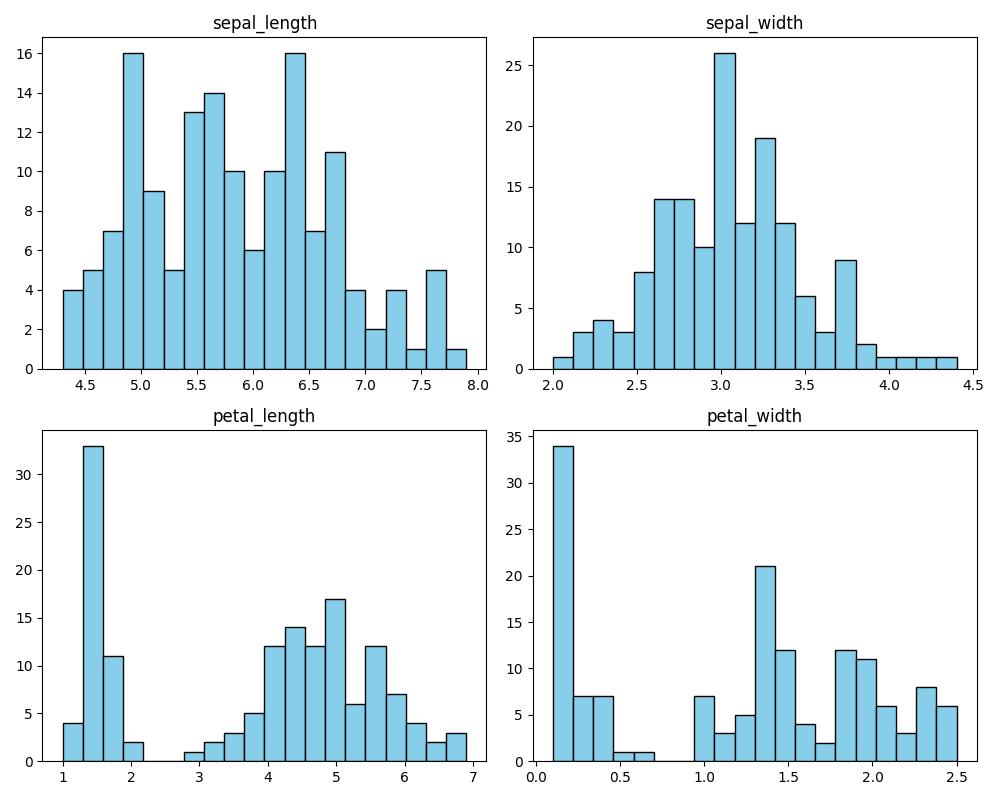

# Simple AI Agent

## Setup

```bash
uv sync

mv .env.example .env
nano .env
## Add below API keys
# TAVILY_API_KEY=
# OPEN_AI_API_KEY=
```

## Run

```bash
# 計算させる
uv run python -m src.agent "フィボナッチ数の30番目の数字を計算して"

# 調べ物をさせる
uv run python -m src.agent "明日の天気を教えて"
```

## 実行結果例
<details>
<summary>プロンプト: "フィボナッチ数の30番目の数字を計算して"</summary>

```bash
uv run python -m src.agent "フィボナッチ数の30番目の数字を計算して"

==== Start STEP 1 ====
Processing tool action.
TOOL CALL: python_repl(def fibonacci(n):
    a, b = 0, 1
    for _ in range(n):
        a, b = b, a + b
    return a
print(fibonacci(30)))
TOOL OUTPUT (preview): 832040

==== Start STEP 2 ====
Processing final action.
フィボナッチ数列の30番目の数字は832040です。
```

</details>


<details>
<summary>プロンプト: "2つのニュースサイトを訪問して、それぞれのトップニュースを取得して。またその結果を200文字のレポートにまとめて"</summary>

```bash
uv run python -m src.agent "2つのニュースサイトを訪問して、それぞれのトップニュースを取得して。またその結果を200文字のレポートにまとめて"

==== Start STEP 1 ====
Processing tool action.
TOOL CALL: tavily_search(主要ニュースサイトのトップニュース 2025年12月24日)
TOOL OUTPUT (preview): - 2025年12月24日の記事一覧
  https://w

==== Start STEP 2 ====
Processing tool action.
TOOL CALL: tavily_search(読売新聞 トップニュース 2025年12月24日)
TOOL OUTPUT (preview): - 読売新聞 - 12月 24, 2025
  https:

==== Start STEP 3 ====
Processing final action.
2025年12月24日の主要ニュースサイト（朝日新聞・読売新聞）のトップニュースは以下の通りです。

朝日新聞では、トルコでのジェット機墜落事故やウクライナ情勢、国内では出生数の減少や高額療養費の見直し、外国人労働者政策などが大きく報じられています。

読売新聞では、国内金価格の史上最高値更新、電通過労死事件から10年の母親の訴え、高市内閣の高支持率、能登半島地震の孤立集落問題などが注目されています。

両紙とも国際情勢と国内の社会・経済問題を幅広く取り上げており、年末らしい総括や回顧記事も目立ちました。

```

</details>


<details>
<summary>プロンプト: "サイコロを 2 個振って合計 が 12 以上になる確率を厳密計算とモンテカルロ法の両方で求めて"</summary>

```bash
uv run python -m src.agent "サイコロを 2 個振って合計 が 12 以上になる確率を厳密計算とモンテカルロ法の両方で求めて"

==== Start STEP 1 ====
Processing tool action.
TOOL CALL: python_repl(# サイコロ2個の合計が12以上になる確率（厳密計算）
# サイコロは6面なので、2個振ると出る目の合計は2～12
# それぞれの目の出る組み合わせを数える

total = 0
success = 0
for i in range(1, 7):
    for j in range(1, 7):
        total += 1
        if i + j >= 12:
            success += 1
exact_prob = success / total
print(exact_prob)
)
TOOL OUTPUT (preview): 0.027777777777777776


==== Start STEP 2 ====
Processing tool action.
TOOL CALL: python_repl(import random
# モンテカルロ法でサイコロ2個の合計が12以上になる確率を推定
trials = 1000000
success = 0
for _ in range(trials):
    dice1 = random.randint(1, 6)
    dice2 = random.randint(1, 6)
    if dice1 + dice2 >= 12:
        success += 1
monte_carlo_prob = success / trials
print(monte_carlo_prob)
)
TOOL OUTPUT (preview): 0.027617


==== Start STEP 3 ====
Processing final action.
サイコロを2個振って合計が12以上になる確率は、

・厳密計算では約0.0278（=2.78%）
・モンテカルロ法による推定では約0.0276（=2.76%）

となります。どちらもほぼ同じ値で、サイコロ2個で合計12以上（つまり12のみ）は非常にまれなことが分かります。
```

</details>


<details>
<summary>プロンプト: "アヤメのデータセットを取得して、各特徴量をヒストグラムとして画像化して"</summary>

```bash
uv run python -m src.agent "アヤメのデータセットを取得して、各特徴量をヒストグラムとして画像化して"

==== Start STEP 1 ====
Processing tool action.
TOOL CALL: tavily_search(アヤメ データセット ダウンロード)
TOOL OUTPUT (preview): - Irisデータセットのダウンロード | Excel VB

==== Start STEP 2 ====
Processing tool action.
TOOL CALL: python_repl(import matplotlib.pyplot as plt
from sklearn.datasets import load_iris
import pandas as pd

# アヤメデータセットの取得
data = load_iris()
df = pd.DataFrame(data.data, columns=data.feature_names)

# 各特徴量のヒストグラムを描画
fig, axes = plt.subplots(2, 2, figsize=(10, 8))
axes = axes.flatten()
for i, col in enumerate(df.columns):
    axes[i].hist(df[col], bins=20, color='skyblue', edgecolor='black')
    axes[i].set_title(col)
plt.tight_layout()
plt.savefig('iris_hist.png')
print('iris_hist.png'))
TOOL OUTPUT (preview): No module named 'sklearn'

==== Start STEP 3 ====
Processing tool action.
TOOL CALL: python_repl(import matplotlib.pyplot as plt
import seaborn as sns
import pandas as pd
import urllib.request

# Irisデータセットを直接ダウンロード
url = 'https://raw.githubusercontent.com/pandas-dev/pandas/main/pandas/tests/io/data/csv/iris.csv'
filename = 'iris.csv'
urllib.request.urlretrieve(url, filename)

# データ読み込み
cols = ['sepal_length', 'sepal_width', 'petal_length', 'petal_width', 'species']
df = pd.read_csv(filename, names=cols, header=0)

# 各特徴量のヒストグラムを描画
fig, axes = plt.subplots(2, 2, figsize=(10, 8))
axes = axes.flatten()
for i, col in enumerate(cols[:-1]):
    sns.histplot(df[col], bins=20, ax=axes[i], color='skyblue', edgecolor='black')
    axes[i].set_title(col)
plt.tight_layout()
plt.savefig('iris_hist.png')
print('iris_hist.png'))
TOOL OUTPUT (preview): No module named 'seaborn'

==== Start STEP 4 ====
Processing tool action.
TOOL CALL: python_repl(import matplotlib.pyplot as plt
import pandas as pd
import urllib.request

# Irisデータセットを直接ダウンロード
url = 'https://raw.githubusercontent.com/pandas-dev/pandas/main/pandas/tests/io/data/csv/iris.csv'
filename = 'iris.csv'
urllib.request.urlretrieve(url, filename)

# データ読み込み
cols = ['sepal_length', 'sepal_width', 'petal_length', 'petal_width', 'species']
df = pd.read_csv(filename, names=cols, header=0)

# 各特徴量のヒストグラムを描画
fig, axes = plt.subplots(2, 2, figsize=(10, 8))
axes = axes.flatten()
for i, col in enumerate(cols[:-1]):
    axes[i].hist(df[col], bins=20, color='skyblue', edgecolor='black')
    axes[i].set_title(col)
plt.tight_layout()
plt.savefig('iris_hist.png')
print('iris_hist.png'))
TOOL OUTPUT (preview): iris_hist.png


==== Start STEP 5 ====
Processing final action.
アヤメ（Iris）データセットの各特徴量（sepal_length, sepal_width, petal_length, petal_width）のヒストグラム画像を作成しました。

画像ファイル名：iris_hist.png

この画像には、4つの特徴量それぞれの値の分布がヒストグラムとして表示されています。ご希望の可視化が完了しました。
```



</details>
